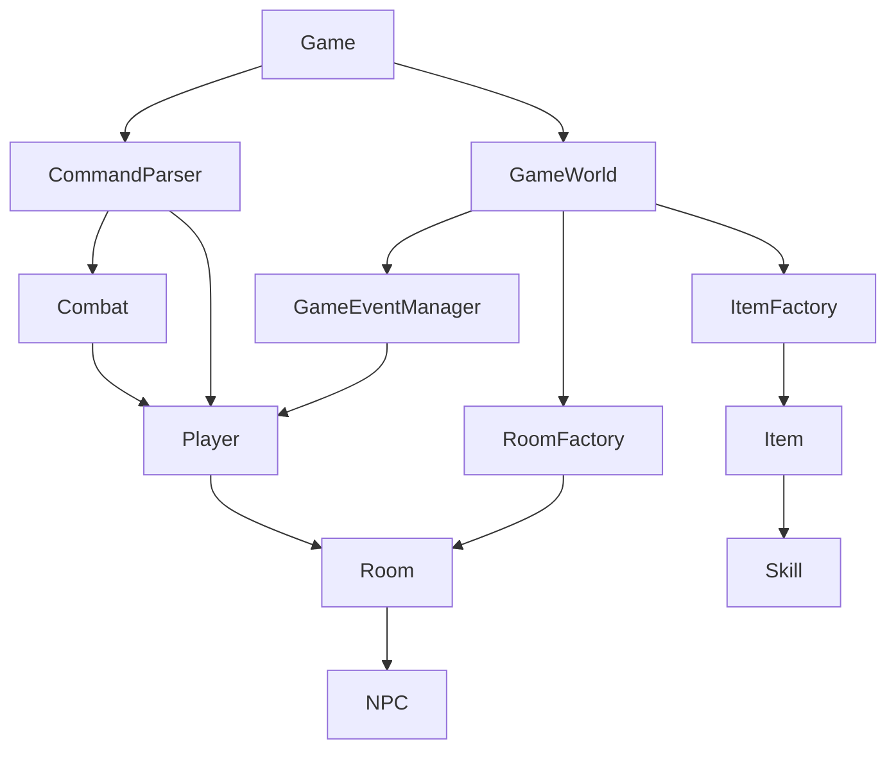
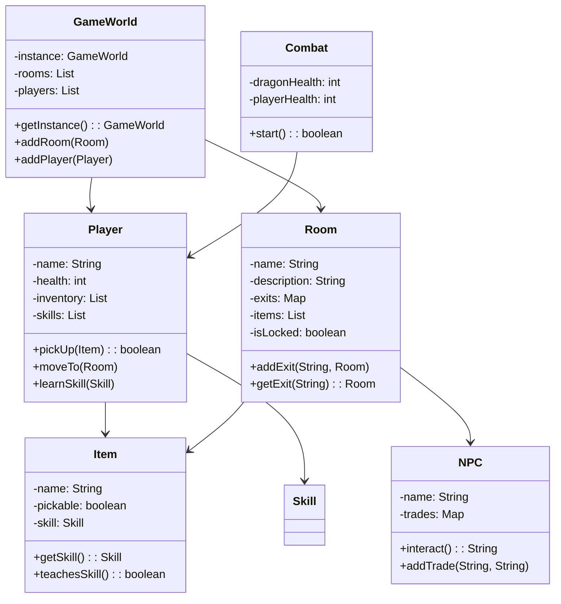

# Dungeon of the Forgotten King
### CS1OPNU Object-Oriented Programming — Coursework 1

---

## Student Information
- **Student Number:** 33804442
- **Module:** CS1OPNU
- **Actual hours spent:** 10 hours
- **AI Tools Used:** Claude (claude.ai) — used to assist with
  design patterns implementation, debugging, and code structure.

---

## Introduction
Dungeon of the Forgotten King is a multi-player text-based
adventure game built in Java. Players can explore a cursed dungeon,
collect magic weapons to learn combat skills, gather ancient
artifacts, and face a dragon guardian in turn-based combat.

The game supports 1-2 players in local turn-based mode and
demonstrates three core software design patterns: Singleton,
Observer, and Factory.

---

## How to Run
1. Open the project in IntelliJ IDEA
2. Ensure JDK 21+ is installed
3. Run `src/game/core/Game.java`
4. Follow the on-screen instructions to play

### Commands
| Command | Description |
|---------|-------------|
| `look` | Look around the current room |
| `go [direction]` | Move north/south/east/west |
| `pick up [item]` | Pick up an item |
| `drop [item]` | Drop an item |
| `use [item]` | Use an item (e.g. Health Potion) |
| `inventory` | Check your inventory |
| `skills` | Check your learned skills |
| `talk` | Talk to NPC in the room |
| `trade [item]` | Trade an item with NPC |
| `help` | Show all commands |
| `quit` | Exit the game |

---

## Game Objective
1. Find the **Magic Sword** → learn **Slash**
2. Find the **Magic Staff** → learn **Fireball**
3. Find the **Dragon Shield** → learn **Block**
4. Collect all **3 Forgotten Artifacts**
5. Enter the **Boss Chamber** and defeat the dragon!

---

## Game Map
[Ancient Library] ←→ [Boss Chamber]  
↕  
[Entrance Hall]  ←→ [Armory] ←→ [Crypt🔒] ←→ [Treasure Room]

🔒 Crypt is locked — trade with the merchant for the Ancient Key!

---

## Requirements
Features implemented in priority order:

1. Multiple interconnected rooms with descriptions
2. Item system with pickable and non-pickable items
3. Player system with inventory management
4. Singleton pattern — GameWorld
5. Factory pattern — RoomFactory and ItemFactory
6. Observer pattern — GameEventManager
7. Turn-based combat system with skills
8. NPC merchant with trade system
9. Locked room mechanic
10. Unit tests (16 tests passing)
11. Command-line interface
12. Multi-player local turn-based support

---

## Design

### Design Patterns

**Singleton — GameWorld**  
GameWorld uses the Singleton pattern to ensure only one game
world instance exists, providing a global access point to the
game state shared by all players.

**Factory — RoomFactory & ItemFactory**  
The Factory pattern is used to create game objects. RoomFactory
and ItemFactory produce fully configured rooms and items from
type strings, separating object creation from game logic.

**Observer — GameEventManager**  
The Observer pattern is implemented through GameEventManager
and GameEventListener. Players subscribe to game events and
are automatically notified when the game state changes, such
as when items are picked up or players move between rooms.

### Architecture Diagram

### Class Diagram

---

## AI Usage
Claude (claude.ai) was used to assist with:
- Singleton, Observer and Factory pattern implementation
- Debugging Java errors
- Game design suggestions
- Unit test structure

All code was reviewed and understood before inclusion.